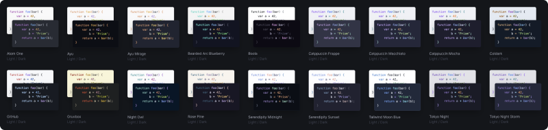

# Automad Prism Themes

A modern [collection](https://automadcms.github.io/automad-prism-themes) of more than 60 trending syntax highlighting themes for [Prism](https://prismjs.com).

[](https://automadcms.github.io/automad-prism-themes/)

| [Visit Theme Gallery](https://automadcms.github.io/automad-prism-themes) | [Browse CDN](https://unpkg.com/browse/automad-prism-themes@latest/dist/) |
| :----------------------------------------------------------------------: | :----------------------------------------------------------------------: |

---

<!-- vim-markdown-toc GFM -->

- [Included Themes](#included-themes)
- [Light & Dark Mode Combos](#light--dark-mode-combos)
- [How to use a Theme](#how-to-use-a-theme)
- [Customizing](#customizing)
- [Adding new Themes](#adding-new-themes)

<!-- vim-markdown-toc -->

## Included Themes

A gallery with screenshots of all included themes can be found [here](https://automadcms.github.io/automad-prism-themes).

## Light & Dark Mode Combos

This collection also comes with a couple of [theme combos](https://automadcms.github.io/automad-prism-themes) that support toggling light and dark mode out of the box. These combos come in two flavors — one light and one dark color scheme.

## How to use a Theme

To use one of the themes, just include the theme's CSS file in your page. Theme files can be directly loaded from [CDN](https://unpkg.com/browse/automad-prism-themes@latest/dist/) or included locally. Example:

```html
<!doctype html>
<html>
  <head>
    ...
    <link
      href="https://unpkg.com/automad-prism-themes/dist/prism-tokyo-night.css"
      rel="stylesheet"
    />
  </head>
  <body>
    ...
    <script src="https://unpkg.com/prismjs@1.29.0/components/prism-core.min.js"></script>
    <script src="https://unpkg.com/prismjs@1.29.0/plugins/autoloader/prism-autoloader.min.js"></script>
  </body>
</html>
```

## Customizing

Some basic theme settings are exposed using CSS custom properties. These properties can be defined for better integration into a site's theme.

```css
:root {
  --am-prism-padding-y: 1rem;
  --am-prism-padding-x: 1rem;
  --am-prism-border-width: 1px;
  --am-prism-border-radius: 0.3em;
  --am-prism-font-size: 0.875rem;
  --am-prism-font-family: ui-monospace;
  --am-prism-line-height: 1.5;
}
```

## Adding new Themes

> [!IMPORTANT]
> This collection is carefully curated and serves as the main repository of Prism themes for Automad. Please understand that pull-request have a high chance of being ignored. In case you are missing a theme, feel free to request it by opening an issue.

Follow these steps in order to add a new theme:

1. Add a new `.css` file following the `prism-[theme].css` naming pattern including the theme styles.
2. Remove all common styles that are already defined in `themes/base.css`. (See other themes)
3. Preview the theme in the included PHP testing page. (`index.php`)
4. Generate missing screenshots:
   ```bash
   npm run screenshots
   ```
